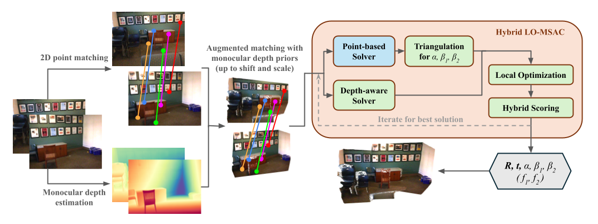

# MADPose

<!-- <a href="https://arxiv.org/abs/"></a> -->

This repo contains the official implementation of the solvers and estimators proposed in the paper "Relative Pose Estimation through Affine Corrections of Monocular Depth Priors". The solvers and estimators are implemented using C++, and we provide easy-to-use Python bindings. 

Note: "**MAD**" is an acronym for "**M**onocular **A**ffine **D**epth".


**Overview**: Our method takes a pair of images as input, runs off-the-shelf feature matching and monocular depth
estimation, then jointly estimates the relative pose, scale and shift parameters of the two depth maps, and optionally the focal lengths.

## Evaluation
We develop three solvers for relative pose estimation that explicitly account for independent affine (scale and shift) ambiguities, tailored for three setups of cameras: calibrated, shared-focal, and unknown focal lengths (two-focal). The solvers are further combined with classic point-based solvers and epipolar constraints in our hybrid RANSAC estimators. Our estimators show consistent improvements across different datasets with different feature matchers and monocular depth estimation models. 

Some highlight results (probably best viewed in light theme on GitHub!):

#### Pose Error AUCs on ScanNet-1500 with shared-focal setting
<table style="border-collapse: collapse; margin: 20px 0; font-size: 14px; font-family: -apple-system,BlinkMacSystemFont,Segoe UI,Helvetica,Arial,sans-serif; min-width: 600px;">
    <thead>
        <tr style="border-bottom: 3px solid #ddd; text-align: center;">
            <th style="padding: 12px 8px; text-align: center;">Matches</th>
            <th style="padding: 12px 8px; text-align: center;">Method</th>
            <th style="padding: 12px 8px; text-align: center;">MD Model</th>
            <th style="padding: 12px 8px; text-align: center;">AUC@5°</th>
            <th style="padding: 12px 8px; text-align: center;">AUC@10°</th>
            <th style="padding: 12px 8px; text-align: center;">AUC@20°</th>
        </tr>
    </thead>
    <tbody>
        <tr style="border-bottom: 1px solid #eee;">
            <td rowspan="2" style="padding: 8px; text-align: center;">SP+SG</td>
            <td style="padding: 8px;">PoseLib-6pt</td>
            <td style="padding: 8px; text-align: center;">-</td>
            <td style="padding: 8px; text-align: center;">12.84</td>
            <td style="padding: 8px; text-align: center;">28.13</td>
            <td style="padding: 8px; text-align: center;">45.64</td>
        </tr>
        <tr style="border-bottom: 2px solid #eee;">
            <td style="padding: 8px;">Ours-sf</td>
            <td style="padding: 8px; text-align: center;">DA-met.</td>
            <td style="padding: 8px; text-align: center;"><b>18.35</b></td>
            <td style="padding: 8px; text-align: center;"><b>37.54</b></td>
            <td style="padding: 8px; text-align: center;"><b>57.58</b></td>
        </tr>
        <tr style="border-bottom: 1px solid #eee;">
            <td rowspan="2" style="padding: 8px; text-align: center;">RoMa</td>
            <td style="padding: 8px;">PoseLib-6pt</td>
            <td style="padding: 8px; text-align: center;">-</td>
            <td style="padding: 8px; text-align: center;">27.17</td>
            <td style="padding: 8px; text-align: center;">49.24</td>
            <td style="padding: 8px; text-align: center;">67.42</td>
        </tr>
        <tr style="border-bottom: 2px solid #eee;">
            <td style="padding: 8px;">Ours-sf</td>
            <td style="padding: 8px; text-align: center;">DA-met.</td>
            <td style="padding: 8px; text-align: center;"><b>29.81</b></td>
            <td style="padding: 8px; text-align: center;"><b>53.11</b></td>
            <td style="padding: 8px; text-align: center;"><b>71.15</b></td>
        </tr>
        <tr style="border-bottom: 1px solid #eee;">
            <td rowspan="3" style="padding: 8px; text-align: center;">MASt3R</td>
            <td style="padding: 8px;">PoseLib-6pt</td>
            <td style="padding: 8px; text-align: center;">-</td>
            <td style="padding: 8px; text-align: center;">30.28</td>
            <td style="padding: 8px; text-align: center;">54.16</td>
            <td style="padding: 8px; text-align: center;">72.87</td>
        </tr>
        <tr style="border-bottom: 1px solid #eee;">
            <td rowspan="2" style="padding: 8px;">Ours-sf</td>
            <td style="padding: 8px; text-align: center;">DA-met.</td>
            <td style="padding: 8px; text-align: center;"><i>31.87</i></td>
            <td style="padding: 8px; text-align: center;"><i>56.20</i></td>
            <td style="padding: 8px; text-align: center;"><i>74.51</i></td>
        </tr>
        <tr style="border-bottom: 1px solid #eee;">
            <td style="padding: 8px; text-align: center;">MASt3R</td>
            <td style="padding: 8px; text-align: center;"><b>32.58</b></td>
            <td style="padding: 8px; text-align: center;"><b>56.99</b></td>
            <td style="padding: 8px; text-align: center;"><b>74.91</b></td>
        </tr>
        <tr style="border-bottom: 1px solid #eee;">
            <td colspan="3" style="padding: 8px; text-align: center;">Reference entry - DUSt3R</td>
            <td style="padding: 8px; text-align: center;">25.90</td>
            <td style="padding: 8px; text-align: center;">48.45</td>
            <td style="padding: 8px; text-align: center;">68.03</td>
        </tr>
        <tr style="border-bottom: 1px solid #eee;">
            <td colspan="3" style="padding: 8px; text-align: center;">Reference entry - MASt3R</td>
            <td style="padding: 8px; text-align: center;">23.94</td>
            <td style="padding: 8px; text-align: center;">46.44</td>
            <td style="padding: 8px; text-align: center;">66.18</td>
        </tr>
    </tbody>
</table>

#### Pose Error AUCs on 2D-3D-S sampled image pairs with unknown focal lengths
<table style="border-collapse: collapse; margin: 20px 0; font-size: 14px; font-family: -apple-system,BlinkMacSystemFont,Segoe UI,Helvetica,Arial,sans-serif; min-width: 700px;">
    <thead>
        <tr style="border-bottom: 3px solid #ddd; text-align: center;">
            <th style="padding: 12px 8px; text-align: center;">Matches</th>
            <th style="padding: 12px 8px; text-align: center;">Method</th>
            <th style="padding: 12px 8px; text-align: center;">MD Model</th>
            <th style="padding: 12px 8px; text-align: center;">AUC@2°</th>
            <th style="padding: 12px 8px; text-align: center;">AUC@5°</th>
            <th style="padding: 12px 8px; text-align: center;">AUC@10°</th>
            <th style="padding: 12px 8px; text-align: center;">AUC@20°</th>
        </tr>
    </thead>
    <tbody>
        <tr style="border-bottom: 1px solid #eee;">
            <td rowspan="2" style="padding: 8px; text-align: center;">SP+LG</td>
            <td style="padding: 8px;">PoseLib-7pt</td>
            <td style="padding: 8px; text-align: center;">-</td>
            <td style="padding: 8px; text-align: center;">5.85</td>
            <td style="padding: 8px; text-align: center;">13.95</td>
            <td style="padding: 8px; text-align: center;">21.94</td>
            <td style="padding: 8px; text-align: center;">30.71</td>
        </tr>
        <tr style="border-bottom: 2px solid #eee;">
            <td style="padding: 8px;">Ours-tf</td>
            <td style="padding: 8px; text-align: center;">DAv2-met.</td>
            <td style="padding: 8px; text-align: center;"><b>9.15</b></td>
            <td style="padding: 8px; text-align: center;"><b>22.22</b></td>
            <td style="padding: 8px; text-align: center;"><b>32.80</b></td>
            <td style="padding: 8px; text-align: center;"><b>43.26</b></td>
        </tr>
        <tr style="border-bottom: 1px solid #eee;">
            <td rowspan="2" style="padding: 8px; text-align: center;">RoMa</td>
            <td style="padding: 8px;">PoseLib-7pt</td>
            <td style="padding: 8px; text-align: center;">-</td>
            <td style="padding: 8px; text-align: center;">8.73</td>
            <td style="padding: 8px; text-align: center;">20.31</td>
            <td style="padding: 8px; text-align: center;">30.45</td>
            <td style="padding: 8px; text-align: center;">41.48</td>
        </tr>
        <tr style="border-bottom: 2px solid #eee;">
            <td style="padding: 8px;">Ours-tf</td>
            <td style="padding: 8px; text-align: center;">DAv2-met.</td>
            <td style="padding: 8px; text-align: center;"><b>13.50</b></td>
            <td style="padding: 8px; text-align: center;"><b>29.19</b></td>
            <td style="padding: 8px; text-align: center;"><b>42.18</b></td>
            <td style="padding: 8px; text-align: center;"><b>54.42</b></td>
        </tr>
        <tr style="border-bottom: 1px solid #eee;">
            <td rowspan="3" style="padding: 8px; text-align: center;">MASt3R</td>
            <td style="padding: 8px;">PoseLib-7pt</td>
            <td style="padding: 8px; text-align: center;">-</td>
            <td style="padding: 8px; text-align: center;">12.58</td>
            <td style="padding: 8px; text-align: center;">30.27</td>
            <td style="padding: 8px; text-align: center;">45.57</td>
            <td style="padding: 8px; text-align: center;">59.85</td>
        </tr>
        <tr style="border-bottom: 1px solid #eee;">
            <td rowspan="2" style="padding: 8px;">Ours-tf</td>
            <td style="padding: 8px; text-align: center;">DAv2-met.</td>
            <td style="padding: 8px; text-align: center;"><i>18.05</i></td>
            <td style="padding: 8px; text-align: center;"><i>39.92</i></td>
            <td style="padding: 8px; text-align: center;"><i>56.64</i></td>
            <td style="padding: 8px; text-align: center;"><i>70.86</i></td>
        </tr>
        <tr style="border-bottom: 1px solid #eee;">
            <td style="padding: 8px; text-align: center;">MASt3R</td>
            <td style="padding: 8px; text-align: center;"><b>22.44</b></td>
            <td style="padding: 8px; text-align: center;"><b>48.02</b></td>
            <td style="padding: 8px; text-align: center;"><b>64.79</b></td>
            <td style="padding: 8px; text-align: center;"><b>76.55</b></td>
        </tr>
        <tr style="border-bottom: 1px solid #eee;">
            <td colspan="3" style="padding: 8px; text-align: center;">Reference entry - DUSt3R</td>
            <td style="padding: 8px; text-align: center;">6.43</td>
            <td style="padding: 8px; text-align: center;">24.47</td>
            <td style="padding: 8px; text-align: center;">42.39</td>
            <td style="padding: 8px; text-align: center;">58.36</td>
        </tr>
        <tr style="border-bottom: 1px solid #eee;">
            <td colspan="3" style="padding: 8px; text-align: center;">Reference entry - MASt3R</td>
            <td style="padding: 8px; text-align: center;">13.39</td>
            <td style="padding: 8px; text-align: center;">38.41</td>
            <td style="padding: 8px; text-align: center;">57.92</td>
            <td style="padding: 8px; text-align: center;">71.91</td>
        </tr>
    </tbody>
</table>
Please refer to the paper for more results and discussions.

## Installation
### Install from PyPI
We are working on setting up wheel for easy installation using PyPI. Currently please use the following method to install from source.

### Install from source
#### Install dependencies
```bash
sudo apt-get install libeigen3-dev libceres-dev libopencv-dev
```
_Note: The two-focal estimator currently relies on `cv::recoverPose` from OpenCV, we plan to remove dependency on OpenCV in future updates._

#### Clone the repo
```bash
git clone --recursive https://github.com/MarkYu98/madpose
```

#### Build and install the Python bindings
```bash
pip install .
```
If you would like to see the building process (e.g. CMake logs) you can add `-v` option to the above command.

#### Check the installation
```bash
python -c "import madpose"
```
You should not see any errors if MADPose is successfully installed.

## Usage
### Estimators
We provide Python bindings of our 3 hybrid estimators for image pairs with calibrated cameras, shared-focal cameras, and cameras with unknown focal lengths (two-focal). 

The estimators take `HybridLORansacOptions` and `EstimatorConfig` for related settings, some useful settings are:
```python
import madpose

options = madpose.HybridLORansacOptions()
options.min_num_iterations = 1000
options.max_num_iterations = 10000
options.success_probability = 0.9999
options.random_seed = 0 # for reproducibility
options.final_least_squares = True
options.threshold_multiplier = 5.0
options.num_lo_steps = 4
# squared px thresholds for reprojection error and epipolar error
options.squared_inlier_thresholds = [reproj_pix_thres ** 2, epipolar_pix_thres ** 2]
# weight when scoring for the two types of errors
options.data_type_weights = [1.0, epipolar_weight]

est_config = madpose.EstimatorConfig()
# if enabled, the input min_depth values are guaranteed to be positive with the estimated depth offsets (shifts), default: True
est_config.min_depth_constraint = True
# if disabled, will model the depth with only scale (only applicable to the calibrated camera case)
est_config.use_shift = True
```

We provide a example image pairs and code snippets in [examples/](examples/) to test the hybrid estimators. More demos and evaluations will be added in the future. 

We use `numpy` and `cv2` to handle pre-computed data in Python in the examples, you can easily install them using pip:
```bash
pip install numpy opencv-python
```

#### Calibrated estimator
```python
pose, stats = madpose.HybridEstimatePoseScaleOffset(
                  mkpts0, mkpts1, 
                  depth0, depth1,
                  [depth_map0.min(), depth_map1.min()], 
                  K0, K1, options, est_config
              )
# rotation and translation of the estimated pose
R_est, t_est = pose.R(), pose.t()
# scale and offsets of the affine corrected depth maps
s_est, o0_est, o1_est = pose.scale, pose.offset0, pose.offset1
```
The parameters are: keypoint matches(`mkpts0`, `mkpts1`), their corresponding depth prior values(`depth0`, `depth1`), min depth values for both views (used when `est_config.min_depth_constraint` is `True`), camera intrinsics(`K0`, `K1`),`options`, and `est_config`.

See [examples/calibrated.py](examples/calibrated.py) for a complete code example, evaluation, and comparison with point-based estimation using PoseLib.

#### Shared-focal estimator
```python
pose, stats = madpose.HybridEstimatePoseScaleOffsetSharedFocal(
                  mkpts0, mkpts1, 
                  depth0, depth1,
                  [depth_map0.min(), depth_map1.min()], 
                  pp0, pp1, options, est_config
              )
# rotation and translation of the estimated pose
R_est, t_est = pose.R(), pose.t()
# scale and offsets of the affine corrected depth maps
s_est, o0_est, o1_est = pose.scale, pose.offset0, pose.offset1
# estimated shared focal length
f_est = pose.focal
```
Different from the calibrated estimator, now instead of intrinsics(`K0`, `K1`), the shared-focal estimator now takes as input the principal points(`pp0`, `pp1`).

See [examples/shared_focal.py](examples/shared_focal.py) for complete example.

#### Two-focal estimator
```python
pose, stats = madpose.HybridEstimatePoseScaleOffsetTwoFocal(
                  mkpts0, mkpts1, depth0, depth1,
                  [depth_map0.min(), depth_map1.min()], 
                  pp0, pp1, options, est_config
              )
# rotation and translation of the estimated pose
R_est, t_est = pose.R(), pose.t()
# scale and offsets of the affine corrected depth maps
s_est, o0_est, o1_est = pose.scale, pose.offset0, pose.offset1
# the estimated two focal lengths
f0_est, f1_est = pose.focal0, pose.focal1
```
The parameters are same with the shared-focal estimator, but now the estimator will estimate two independent focal lengths.

See [examples/two_focal.py](examples/two_focal.py) for complete example.

#### Point-based baseline
You can compare with point-based estimators from [PoseLib](https://github.com/PoseLib/PoseLib). You need to install the [Poselib's Python bindings](https://github.com/PoseLib/PoseLib?tab=readme-ov-file#python-bindings). 

The corresponding point-based estimation are included in each of the three example scripts above.

### Solvers
Our hybrid estimators combine our newly proposed depth-aware solvers with the point-based solvers. The Python implementation of the solvers can be found under [solver_py/](solver_py/), which also include calls to the C++ solvers through Python bindings for comparison.

As described in the paper, the proposed solvers all work in a 2-step manner, first solve for the depth scale and shifts (affine parameters) of the depth maps and then recover the pose by finding the rigid transformation between the back-projected points. We provide Python bindings for the first step (solving scale and shifts) as well as combined wrapper for both the pose and the affine parameters.

The bindings for solving the affine parameters:
```python
# Calibrated case
affine_params = madpose.solve_scale_and_shift(x1.T, x2.T, d1, d2) 
# Shared-focal
affine_params = madpose.solve_scale_and_shift_shared_focal(x1.T, x2.T, d1, d2)
# Two-focal
affine_params = madpose.solve_scale_and_shift_two_focal(x1.T, x2.T, d1, d2)
```
The input `x1` and `x2` are `np.array` (or list) of homogeneous normalized image coordinates (`[x, y, 1]`) of the minimal set of $M$ matched keypoints; `d1` and `d2` are `np.array` (or list) of the corresponding depth values. The returned `affine_params` is a list of candidate solutions `(a1, a2, b1, b2)` with `a1` always equal to 1 and therefore `a2, b1, b2` correspond to the scale and shift values $\alpha, \beta_1, \beta_2$.

Or we can use the combined wrapper that solves affine parameters and also recover the candidate poses:
```python
# Calibrated case
poses = madpose.solve_scale_shift_pose(x1.T, x2.T, d1, d2)
# Shared-focal
poses = madpose.solve_scale_shift_pose_shared_focal(x1.T, x2.T, d1, d2)
# Two-focal
poses = madpose.solve_scale_shift_pose_two_focal(x1.T, x2.T, d1, d2)
```
Note that for simplicity the return solutions are all named `poses`, the list contains objects of different classes for the three cases (`madpose.PoseScaleOffset`, `madpose.PoseScaleOffsetSharedFocal`, and `madpose.PoseScaleOffsetTwoFocal`). Retrieve the pose, focal lengths, and affine parameters by:
```python
R_est, t_est = pose.R(), pose.t()
s_est, o0_est, o1_est = pose.scale, pose.offset0, pose.offset1

# for PoseScaleOffsetSharedFocal
f_est = pose.focal

# for PoseScaleOffsetTwoFocal
f0_est, f1_est = pose.focal0, pose.focal1
```

## TODO List

- [ ] Remove dependency on OpenCV.
- [ ] Setup wheel for PyPI
- [ ] Add experiment scirpts on datasets

## Acknowledgement
This codebase is inspired by and built upon many research work and opensource projects, we thank the authors and contributors for their work.
- [PoseLib](https://github.com/PoseLib/PoseLib)
- [COLMAP](https://github.com/colmap/colmap)
- [LIMAP](https://github.com/cvg/limap)
- [SuperGlue](https://github.com/magicleap/SuperGluePretrainedNetwork)
- [RansacLib](https://github.com/tsattler/RansacLib)
- [pybind11](https://github.com/pybind/pybind11)

<!-- ## Citation
If you find our work useful in your research, please consider citing our paper:
```
@misc{}
``` -->
